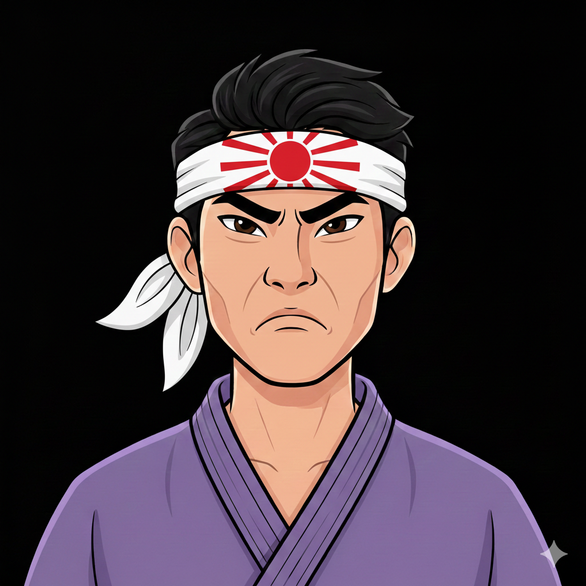

# Extreme Ends: Thoughts

Here are some thoughts a character in this first image would voice. 

**DISCLAIMER**  
The point of this quotes project is not about humor or morality. Since comedy is dead in America, I'd thought these quotes would be of some 
value to today's American context. See, comedic material is only funny in some settings. No one wants to live in a circus. Rather, people 
pay extra to attend a circus, once in a big while. 

- "The guaranteed way to stop dealing with micro-aggressions is to kill the micro-aggressor." 
- "An implication of Heisenberg's Uncertainty Principle: maybe some people should get killed if they obsess over some other people too hard,it becomes threatening."
- "It's because my clock and their clock are different. And I think it's time for them to die...unless they want to step out of the way."
- "What if everyone involved in the campaigns was violently murdered? And the detectives and police that try to crack the cases? And the judges?" 
- "A parent is as good as a wealthy person or an institutionalist. And both kinds should die on a bad day."
- "Tell you what. If everything is a scandal or needs investigation, how about I kill the investigators as well as the alleged victims and perpetrators?" 
- "Everyone trying to make money off the lows should get violently murdered." 
- "If so much work gets done, but the official theory and record, theory for the record, is equilibrium, maybe that would change if some people got killed." 
- "Thanks Russian, for trying to be a hero by sticking up for those criminals, because they're Jews, right? Now I'm going to kill you instead of them. You can be their Jesus now." 
- "Thanks China man, for continuing to do business with the criminal Americans. Now half of Latin America is in poverty. I'm debating whether to kill them or you." 
- "If they can't do any real work besides from mocking and imitating people, maybe they should get killed doing what they love." 
- "Maybe another large terrorist attack by a foreign adversary should happen in America. Then half the Big Security business would be put out of work for incompetence. And it would give people like me an opportunity to kill some of them." 
- "The Anglos are playing a commercial war. They're placing Indians and Pakis as corporate frontmen. So I'm debating whether to bomb their facilities during broad daylight, while those 'innocent' brown people are working, or at night." 
- "The Americans that have committed a bunch of corporate crimes, as well as members of the American mobs, should be killed for causing these economically uncertain times."
- "Every week, the Americans cook up the books for a new menace. When their domestic affairs are peaceful, they blame other countries. When their domestic affairs aren't, they blame immigrants and the poor. Maybe killing all of them would put everyone out of their misery."
- "The last thing I want to deal with is some loser fat fuck American calling me a coward. I should kill them if I see them out in public." 
- "If some people can make up excuses to torture and rob, why would I need excuses to not kill? Some things must be inevitable, even with these simpletons' sick reverse psychology." 
- "Oh, so I'm stupid. I'm retarded. But at least I won't the one getting violently murdered by myself." 
- "How can an American be trusted to honor the rules? There's too many of them, different colors and sizes. I think an American's honor is only as good as their defense racket, which they insist on owning and ruling over. So to kill an American would not be
  honorable, according to them. But to kill an American might be the greatest honor in today's world driven sick and poor and crazy, all because of them."
- "Instead of playing tug-of-war over the truth with them, which they'll just try to whitewash in their favor right after, I should kill them instead."
- "Instead of putting my effort to mocking and trolling leftists, like a stupid Catholic, I could put my energy to better use, killing both the leftist and stupid Catholic."  
- "American society is filled with thieves, do-gooder dumb asses, and traitors. Trust is dead. How easy would it be to single them out and kill them one by one?"
- "The cops struck a deal with the mob, and they did that because the economy went down the gutter. So there's no more honest work to take up anymore. The best course of action would be to kill both of them, since they believe so much in Mexican standoffs." 
- "Maybe the university should get bombed. There's evidence their partner companies were illegally selling drugs to people there. Then those companies would use that as legal cause to conduct poison experiments on them, as part of drug trials. How much drugs
  would it take to cure the dead from a bomb detonation?"
- "The Jew group was the one dealing narcotics. They were sourcing it from Turkey, China and Afghanistan. When people went snooping around, they turned paranoid and went to the KKK and defamation league for help. And they made money out of it.
  It's like the law doesn't work. So there is a choice. Kill the Jews or kill the police for this big screw-up." 
